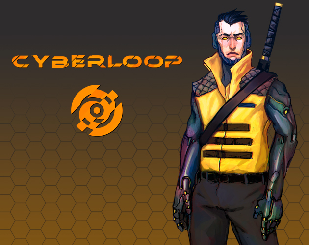
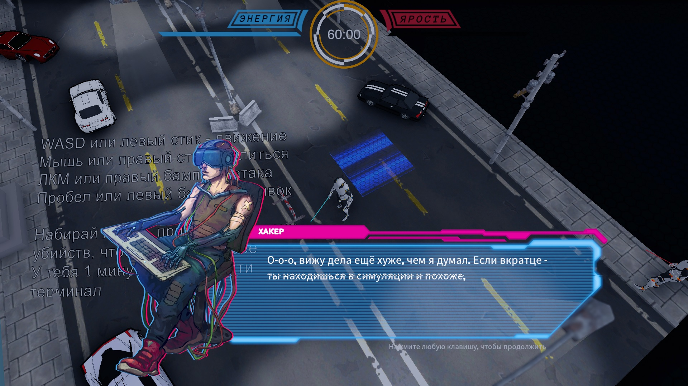
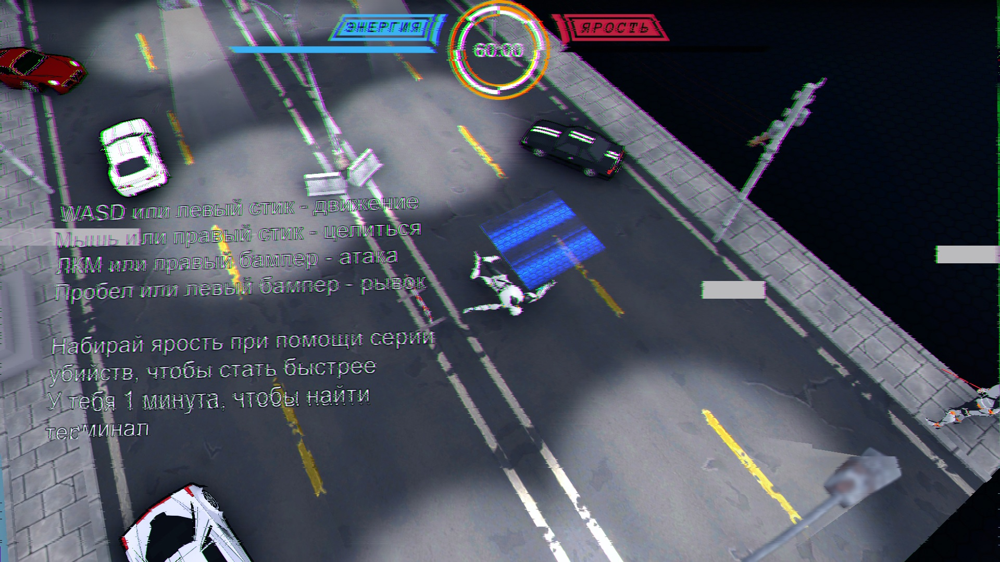
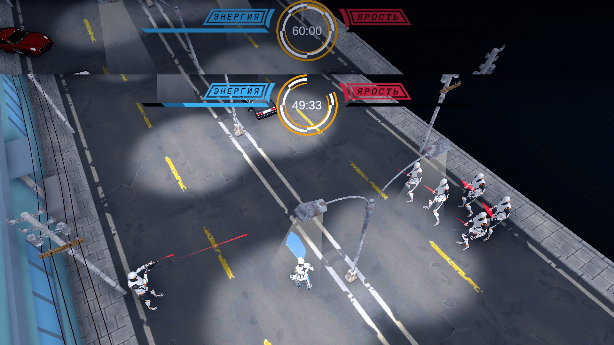
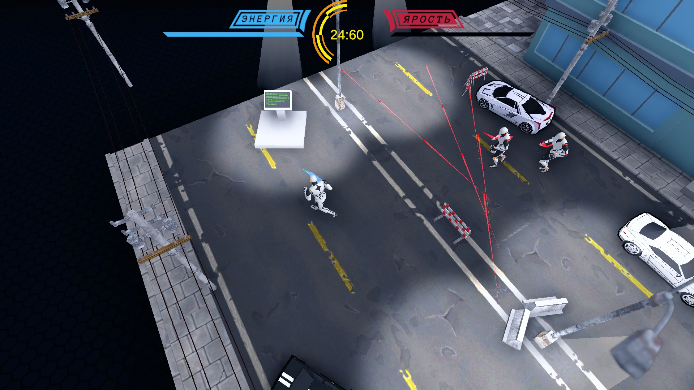
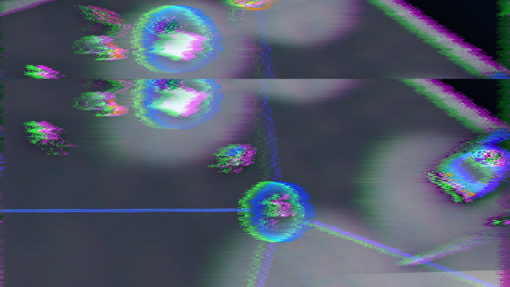

# [Cyberloop](https://teamon.itch.io/cyberloop)

Cyberloop - Fast isometric slasher in cyberpunk setting. Both you and enemies die from 1 hit. And you have 1 minute to complete level.

Game contains 2 levels - corridor level and boss arena. You can start boss battle by using terminal in the end of first map.

## Controls
 * WASD or left stick - move
 * Mouse or right stick - aim
 * LMB or right shoulder - attack
 * Space or left shoulder - dash
 * Fill rage with combo kills to become faster
 * Only 1 minute to find terminal

## Downloads and Links
Available in [Windows, OSX and Linux](https://teamon.itch.io/cyberloop). If you encounter any problem, please leave a issue!

## Credits
 * [Tymofei Solonchuk](https://teamon.itch.io/) - Programmer	
 * [Dmytryi Suloev](https://cylau.itch.io/) - Programmer	
 * [Perehud Maryna](https://www.artstation.com/tmrchr) - 2D artist	
 * Danyl Mukhutdynov - UI designer
 * [Rodyon Radzhyn](https://soundcloud.com/radjin) - Sound designer	
 * [Aleksei Rusetskyi](https://alexey-r.itch.io/) - 3D Artist 
 
 ## Screenshots
 
 
 
 
 
